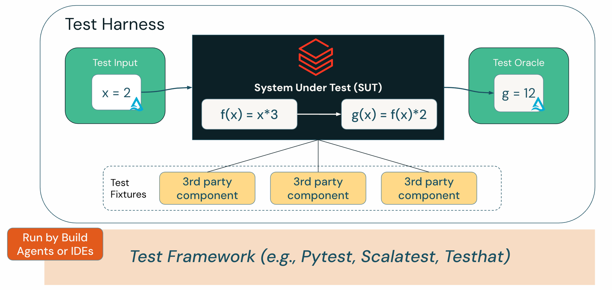
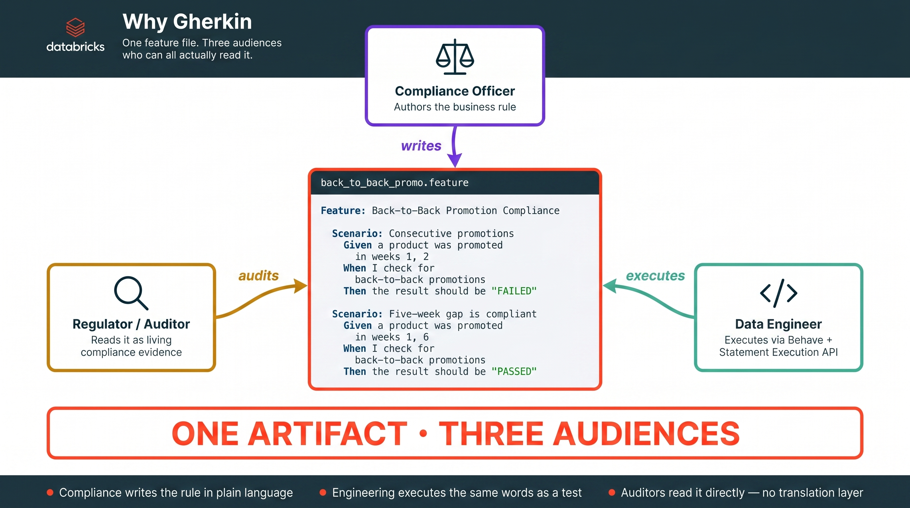
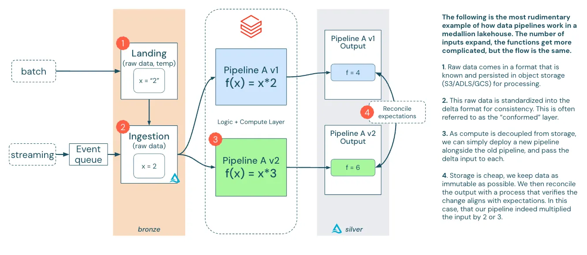
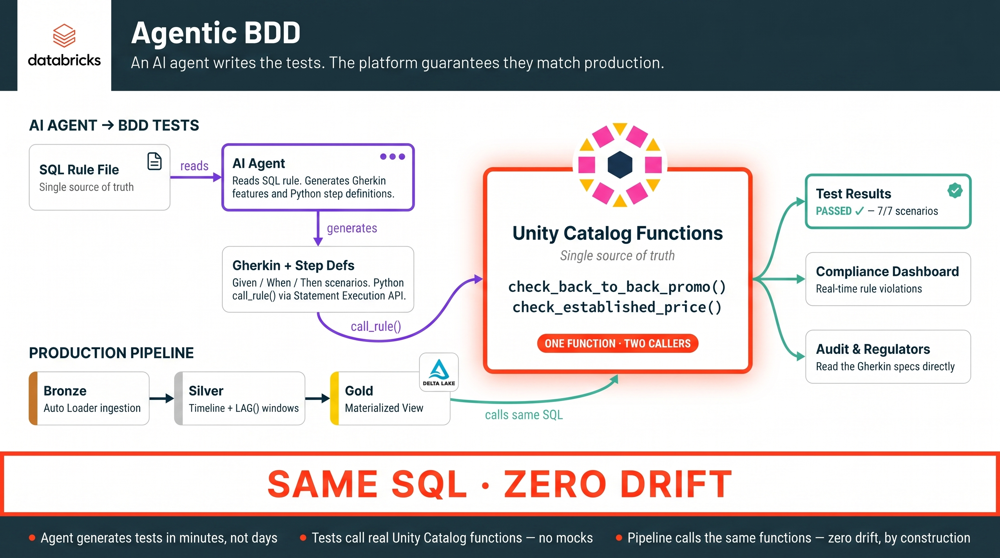
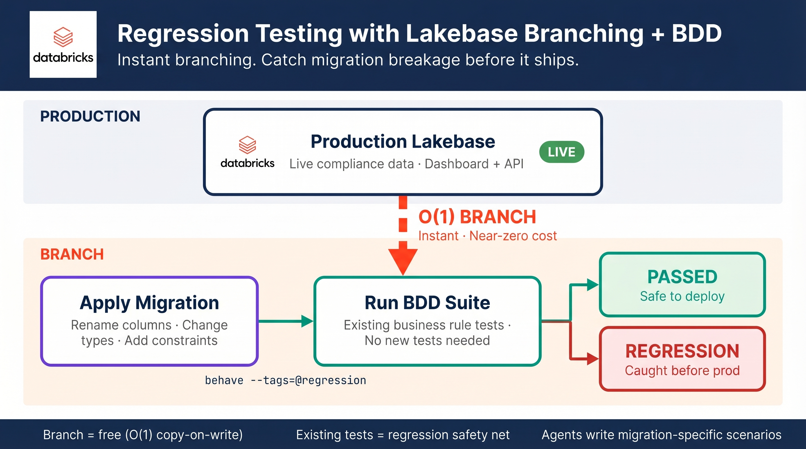
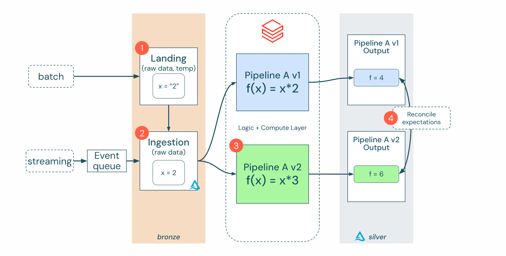

# The test suite nobody had to write: agentic BDD for data pipelines

---

I ended [The Foundation of Modern DataOps](https://medium.com/dbsql-sme-engineering/the-foundation-of-modern-dataops-with-databricks-68e36f5d72e8) with a promise: go deeper on idempotent pipelines and how they fit into the testing story. The Second Way of DataOps says the assumptions you make in development need to be continuously verified in production. This post is about who builds that verification layer now, and why the answer looks different than it did a year ago.

I spent six years as a consultant being a test-driven development zealot. I would spend weeks on an engagement building the right test harness and framework before writing a single line of pipeline code. Some of those investments paid off fantastically. Others were a complete waste of time. Some teams got it, adopted the practice, and kept the tests alive long after I left. Others ripped the tests out the week I walked out the door.

That experience taught me something uncomfortable: the problem was never the tests. It was the cost of maintaining them relative to what the team valued. If your test suite requires a specialist to understand and an hour of setup to run, it's dead the moment the consultant walks out. I saw it happen too many times. The testing gap in data engineering isn't a tooling problem, it's a people problem. The tooling has been there for years. The willingness hasn't.

Data testing is hard because data is stateful. The classic "given this input, assert this output" pattern is trivial when the input is an integer. It's miserable when the input is a 50-column table that has to stay in sync with a production schema drifting under you — every schema change means updating the input fixture, the expected output, and the test code together, and that cost compounds fast.

Better to skip stored fixtures and generate the test data at runtime as code. Scope it to the rule you're testing, refactor it alongside the production change, and no fixture file ever drifts out of sync in source control. BDD fits this cleanly: the Given step is the code that declares the state, and the harness synthesises whatever input shape the rule happens to want this week.


*The anatomy of a test harness. The Test Input box is where "test data as code" lives: synthesised by fixtures at runtime rather than pulled from a stored file. Diagram after Zander, Mosterman & Schieferdecker (2008).*

I wrote about this in a [series on modern data engineering testing](https://medium.com/weareservian/modern-data-engineering-testing-part-2-the-keys-to-unlock-your-test-suite-a3337b7b1278). The move I landed on then was generating test data as code at runtime — parameterised generators beat stored fixtures because you can refactor them in the same commit as the rule they're testing. But the rest of the test stack still had to be hand-built: framework wiring, assertion oracles, fixture libraries, and the discipline to maintain all of it as rules and schemas evolved. On most engagements I rebuilt that plumbing from scratch, and the maintenance cost was what killed the suite once I left.

What's changed since then is the boilerplate cost, not the format. Gherkin was already the right description layer — Given/When/Then makes business rules executable in a way raw pytest can't, and stakeholders can actually read it. What kept BDD out of most data engineering shops was the hand-wiring: someone had to write the feature files, the step definitions, and the harness, and keep all of it in sync as rules and schemas evolved. For most data teams, that "someone" didn't exist. Now the agent is that someone.

## What agents actually made trivial

Agents didn't change the architecture of good data testing. The testing pyramid still holds. Separation of concerns still matters. What agents eliminated was the startup cost: the hours of boilerplate and harness wiring that sat between "we should test this" and "we have tests."

The workflow I've been running with clients on Databricks looks like this. A compliance rule exists as a SQL function in Unity Catalog, the single source of truth. An AI agent reads that SQL, understands the business logic, and generates a Gherkin feature file covering happy paths, violations, boundary conditions, and nulls. The same agent writes the Python step definitions that wire the Gherkin to UC function calls. The harness calls real UC functions via the Statement Execution API. No local Spark, no mocks, no Java dependencies.

The agent handles the tedious part. The human reviews and says "you missed the edge case where the product is in the NT and it's a liquor item." The agent adds that scenario. Thirty minutes instead of three days. It's not perfect on the first pass, and you still need someone who knows the domain to review what it generated, but the starting point is so much better than a blank file.

## Why Gherkin

I haven't found anything that beats Gherkin for this job, and I've tried most of the alternatives. A compliance rule as a feature file (the 4-week window below is one retailer's internal interpretation of ACCC "was/now" guidance, not a regulatory floor — the actual test is whether a prior price was genuinely offered for a reasonable period, and "reasonable" is contextual):

```gherkin
Feature: Back-to-Back Promotion Compliance
  As a compliance officer
  I need to ensure products have a 4-week cooling period between promotions
  So that we comply with ACCC pricing guidelines

  Rule: Products must have a minimum 4-week gap between promotions

  Scenario: Product promoted in consecutive weeks violates cooling period
    Given a product was promoted in weeks 1, 2
    When I check for back-to-back promotions
    Then the result should be "FAILED"

  Scenario: Product with 5-week gap between promotions is compliant
    Given a product was promoted in weeks 1, 6
    When I check for back-to-back promotions
    Then the result should be "PASSED"

  Scenario Outline: Promotion gap validation
    Given a product was promoted in weeks <weeks>
    When I check for back-to-back promotions
    Then the result should be "<expected>"

    Examples: Various gaps
      | weeks      | expected |
      | 1, 2       | FAILED   |
      | 1, 5       | FAILED   |
      | 1, 6       | PASSED   |
      | 1, 6, 11   | PASSED   |
      | 1, 3, 5    | FAILED   |
```

A compliance officer can read this. So can a regulator doing an audit. And a data engineer can execute it directly. How many testing formats give you all three? Raw pytest code achieves maybe one of those, and it's not the compliance officer.


*Three audiences, one artifact. The compliance officer authors the rule, the data engineer executes the same words as a test, and the auditor reads it directly as living compliance evidence. No translation layer between them.*

For an AI agent, Gherkin works even better. Given/When/Then maps cleanly to arrange/act/assert. Scenario Outlines with example tables are basically prompt templates with structured output. Agents produce better test coverage from Gherkin than from freeform requirements because the structure constrains them in useful ways. Same principle as the factory floor metaphor from the DataOps blog: structure the process, and quality follows.

## The architecture

The whole pattern rests on one decision: treat Unity Catalog SQL functions as the single source of truth for row-level deterministic predicates. A business rule that can be expressed as a pure function of its inputs becomes a testable contract. This is a narrow but common class. The moment a rule needs rolling windows across tables, cross-entity joins, or temporal reasoning the caller can't pre-compute, the scalar-UDF shape breaks down and you end up back at table-valued functions or views with documented contracts. The pattern below is for the predicate class, not everything. A rule that checks whether a promotion violates the ACCC's 4-week cooling period:

```sql
CREATE OR REPLACE FUNCTION check_back_to_back_promo(
  is_promoted BOOLEAN,
  prev_promo_week_1 BOOLEAN,
  prev_promo_week_2 BOOLEAN,
  prev_promo_week_3 BOOLEAN,
  prev_promo_week_4 BOOLEAN
)
RETURNS BOOLEAN
RETURN
  is_promoted AND (
    COALESCE(prev_promo_week_1, FALSE) OR
    COALESCE(prev_promo_week_2, FALSE) OR
    COALESCE(prev_promo_week_3, FALSE) OR
    COALESCE(prev_promo_week_4, FALSE)
  );
```

This function is deployed once to Unity Catalog. The BDD tests call it, the production pipeline calls it. Same SQL, no drift. The BDD step definitions call `call_rule()`, which hits the Databricks Statement Execution API:

```python
from tests.bdd.spark_rules import call_rule
from tests.bdd.fixtures import promo_history_to_lag_flags

@when("I check for back-to-back promotions")
def step_check_b2b(context):
    # Fixture translates the domain-level given (weeks promoted) into the
    # lag-flag shape the SQL function expects. The step itself stays thin:
    # arrange the inputs, call the rule verbatim, record the outcome.
    is_promoted, lag_flags = promo_history_to_lag_flags(context.promo_weeks)
    args = ", ".join([str(is_promoted).upper()] + [str(f).upper() for f in lag_flags])
    context.result = "FAILED" if call_rule(f"check_back_to_back_promo({args})") else "PASSED"
```

The gap math belongs in the fixture, not the step. If the step re-derives the rule every time, you now have two implementations that must agree, and the agent that wrote the SQL almost certainly wrote the step the same way — same assumptions, same bugs. A thin `@when` keeps the rule in one place and leaves the fixture as the only translation between domain language ("weeks 1 and 6") and whatever shape the SQL function happens to take this week.

And the production Gold layer? The same function call, embedded in a materialized view:

```sql
CREATE OR REFRESH MATERIALIZED VIEW price_timeline_history AS
WITH timeline_with_lags AS (
  SELECT *,
    LAG(is_promoted, 1) OVER w AS prev_promo_1,
    LAG(is_promoted, 2) OVER w AS prev_promo_2,
    LAG(is_promoted, 3) OVER w AS prev_promo_3,
    LAG(is_promoted, 4) OVER w AS prev_promo_4
  FROM silver_timeline
  WINDOW w AS (PARTITION BY product_id, location_id ORDER BY week_start)
)
SELECT
  ...
  check_back_to_back_promo(
    t.is_promoted, t.prev_promo_1, t.prev_promo_2,
    t.prev_promo_3, t.prev_promo_4
  ) AS b2b_violation,
  ...
FROM timeline_with_lags t;
```


*Pipeline compute is decoupled from storage. Each pipeline version defines its functions. BDD tests validate the function contract before it enters the pipeline.*

The SQL function is the contract, and everything else flows from that. BDD tests verify the contract, the pipeline consumes it, and agents write the verification layer. Humans own the contract itself, which is the only part that requires domain expertise.


*Agents write the test layer (purple). BDD tests call real UC functions (teal). The production pipeline calls those same functions (orange). One artifact, two callers.*

## Why this works now and didn't five years ago

The First Way from the DataOps blog is about making work flow from Dev to Ops as quickly as possible. Agentic BDD is practical today because of three specific platform changes, not because agents got smarter.

The Statement Execution API turned SQL execution into an HTTP call. A test harness can invoke a UC function without a Spark session, a local cluster, or a Java dependency — the difference between tests running in CI in eight seconds and tests needing a 20-minute cluster warmup. The governed UC function catalog means business rules finally have a stable, named, versioned address. Before that existed, "the rule" was a stored procedure in one notebook, a CASE statement in another, and a Python UDF in a third. You can't test a contract that has no address. And Lakeflow SDP handles orchestration, retries, and incremental materialization, which shrinks the test surface to the business rules — which is what BDD is actually good at.

Five years ago, testing a UC function meant understanding both the business domain and the distributed computing layer. That combination of skills was rare. Strip the infrastructure concerns out and the barrier drops from "needs a specialist" to "needs a domain reviewer."

Calling real UC functions over HTTP isn't free, though. Every scenario is a warehouse query, and a Scenario Outline with 200 rows is 200 queries. On a cold Serverless SQL warehouse, startup latency dominates the run time. Plan for a warm pool in CI, batch equivalent scenarios where you can, and watch the DBU cost during the first week of PRs — the bill tends to surprise people, and it's the number you need before deciding whether to keep hitting live SEA or run a local DuckDB subset for fast feedback.

## Where this goes next: Lakebase branching

Everything so far tests UC functions in isolation. That covers business logic well. But the gap I always struggled with as a consultant was one layer up: the application. You could have 100% coverage on your business rule functions and still have the app fall over when someone changes a column type in the Gold layer.

In the compliance system, Gold table data syncs to Lakebase for sub-second operational queries. A dashboard and API read from it. There's no BDD coverage of that layer right now, because standing up a realistic test copy of the production database was always too expensive. Try explaining to your manager that you need a full copy of the production Postgres database just to run your test suite. That conversation rarely goes well.

[Lakebase branching](https://www.databricks.com/blog/how-agentic-software-development-will-change-databases) makes it cheap. Lakebase uses O(1) copy-on-write at the metadata layer, so creating a branch of production is instant and nearly free to provision. The primitive is clearly built for throwaway use — exactly the shape you want for test isolation. Caveat worth stating: O(1) is about metadata, not data. A branch that has to read back 90 days of Gold history still pays the first-touch cost of hydrating cold pages. Free to create, not free to exercise.

Where this really bites is data model changes. You rename a column, change a type, add a NOT NULL constraint, restructure a join in the Gold layer. The UC functions still pass because their signature didn't change. But the app breaks because it expected `compliance_status` to be a string and now it's an enum, or a column got renamed and the API query silently returns NULLs. Function-level tests can't catch those bugs. They're invisible until a customer reports them.

With Lakebase branching, you can catch them. Branch production (instant, O(1) copy-on-write), apply the migration to the branch, run the existing BDD suite against the branched database, and if scenarios that passed before now fail, you've caught a regression before it hits production.

```gherkin
@regression @branched
Feature: Data model migration safety

  Background:
    Given a Lakebase branch from production
    And the v2 schema migration has been applied

  Scenario: Existing compliance queries still return valid results
    When I query compliance results for a known compliant product
    Then the compliance_status should be "PASSED"
    And no fields in the response should be NULL

  Scenario: Dashboard API handles the renamed column
    When I request the compliance detail via the API
    Then the response should include "compliance_issues" not "issue_detail"

  Scenario: Historical records survive the migration
    When I count products with compliance history older than 90 days
    Then the count should match the pre-migration count
```


*Branch production, apply migration, run existing BDD suite, catch breakage before it ships. The branch costs nothing and scales to zero when done.*

The Gherkin scenarios you wrote to verify business rules become your regression safety net for free. You didn't write them for migration testing, but they catch breakage the moment you run them against a migrated branch. The branch costs nothing and scales to zero when the test finishes. An agent generates the migration-specific scenarios, and your existing suite covers everything else.

The idempotency thread I owed from the DataOps blog ties in here. Maxime Beauchemin wrote about [functional data engineering](https://maximebeauchemin.medium.com/functional-data-engineering-a-modern-paradigm-for-batch-data-processing-2327ec32c42a) and the idea of treating data transformations like pure functions: immutable partitions, idempotent tasks, same inputs producing the same outputs every time. That property is what makes BDD tests against pipeline output trustworthy. Without idempotency, a passing test might just mean the data arrived in the right order this time. With it, a pass means the logic is correct.

Your pipeline is a function: data goes in, results come out. If f(x) = x * 2, putting 2 in gives you 4. When you deploy Pipeline v2 where f(x) = x * 3, the same input gives you 6. The reconciliation step is where it gets interesting: does the new output match what the business rules say it should?


*Two pipeline versions process the same immutable inputs. Step 4, "Reconcile expectations," is exactly what BDD scenarios automate.*

That used to be manual. Someone would eyeball the outputs, spot-check a few rows, and hope for the best. With BDD, your Gherkin scenarios define the expected output contract. Run them against Pipeline v1 output and Pipeline v2 output. If v2 passes everything v1 passes, promote it. If something breaks, drop the branch and investigate.

Lakebase branching for isolation, idempotent pipelines for determinism, BDD for a contract a human can read and a machine can execute. The Second Way, working end to end.

## What this pattern doesn't catch

If the agent reads the SQL function and generates Gherkin scenarios from it, the scenarios will prove the SQL does what the SQL does. That's useful. It catches nulls, typos, off-by-ones, and the edge cases a human reviewer skips. It does not catch "the rule itself is wrong." If someone loosens the cooling period from 4 weeks to 2 weeks by mistake, the agent dutifully regenerates a green suite and the bug ships.

The adversarial gap BDD was designed around (the rule author and the implementer are different people, and the test is the contract between them) collapses when one LLM writes both sides. Don't collapse it. Treat the agent as a productivity multiplier on the *implementation* side and keep the rule definition human-authored. In practice: a small golden set of scenarios written by the compliance officer before the SQL exists, reviewed and signed off separately, and never shown to the agent. The agent fills in coverage around it. Golden set is the oracle. Generated scenarios are the scaffolding.

You also need a second CI signal beyond "the tests pass." Mutation testing (Cosmic Ray or equivalent) mutates the SQL function — flipping boolean defaults, widening ranges, swapping AND for OR — and re-runs your suite against each mutant. If the suite still passes, the mutant survived and your tests aren't actually pinning behaviour. A mutation score under ~70% means the suite is theatre. Run the mutation pass against the golden set too — if it can't kill mutants, the rule was specified too loosely to test in the first place, and that's a conversation to have with the compliance officer, not a bug in the harness.

## Why this matters

The test suites that survived after I left consulting had two things in common: they were readable by people who didn't build them, and they were cheap to run. The ones that got ripped out were the opposite. Clever, comprehensive, and completely opaque to the team that inherited them.

Agents fix the cost side. A working test suite for a compliance rule takes under an hour now: feature files, step definitions, harness, real UC function calls. When a rule changes, the agent updates the test suite in the same PR. The maintenance burden that killed every test suite I built as a consultant is gone.

Gherkin fixes the readability side. The team that inherits these tests can actually read them. A compliance officer can review them. A regulator can audit them. They don't need me, or anyone like me, to explain what the tests do.

That's what I spent six years looking for. Tests cheap enough that teams build them and readable enough that teams keep them.

---

*Code examples drawn from a retail pricing compliance system on Databricks using Lakeflow Spark Declarative Pipelines, Unity Catalog functions, and Python Behave. The reference implementation is open source at [databricks-solutions/agentic-bdd-uc-functions](https://github.com/databricks-solutions/agentic-bdd-uc-functions).*
